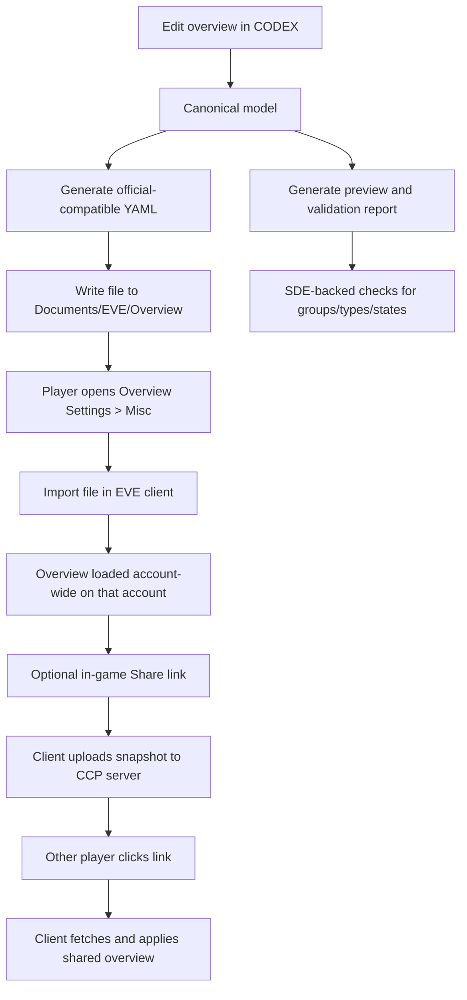
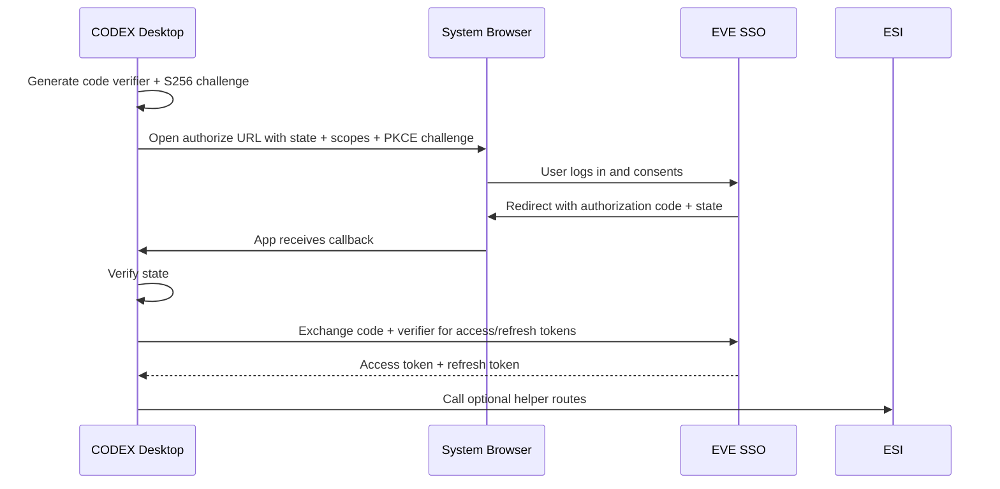
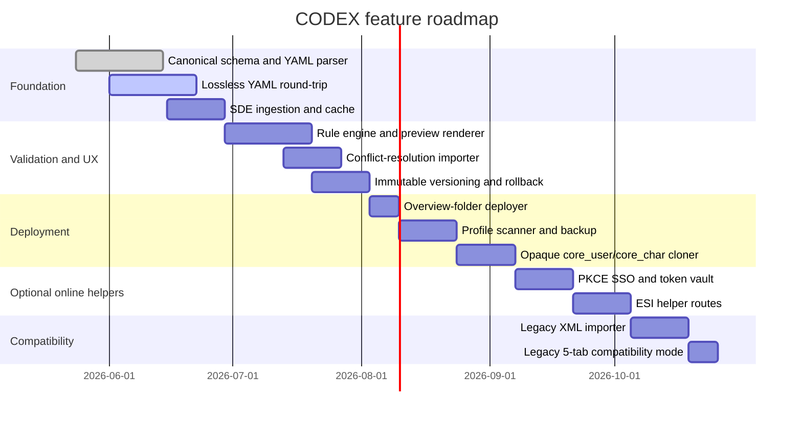

# EVE Online Overview Settings Technical Research for CODEX

## Executive summary

EVE Online’s overview system is split across two fundamentally different domains, and CODEX should model them separately. The **official overview configuration** that players can share, export, import, and partially restore is an in-game UI/settings artifact centered on tabs, presets, states, appearance priorities, columns, ship-label settings, and miscellaneous overview options. CCP’s current support documentation says overview settings are **account-wide** and changes affect all characters on the same account; the same article also says the current client can show **up to 8 tabs**, that the **Share** control can be dragged into chat/mail/notes, and that **exported overview files** are saved to `Documents/EVE/Overview` on both Windows and macOS. citeturn33view0turn22view0

By contrast, **full UI layout and profile cloning** lives in **local profile folders** and opaque binary settings files such as `core_user_*.dat` and `core_char_*.dat`. CCP’s Profile Manager article says profiles are local, can be created per account or character, and have **no server-side backup**; CCP’s support articles also say EVE stores most full client settings locally and that migrating to another PC still requires copying local `settings_*` folders. Community tools that actually synchronize EVE layouts work by **copying entire files**, not by parsing a documented CCP format. citeturn19view0turn17view1turn7view5turn7view6

For CODEX, the architectural consequence is straightforward. **Use official ESI/SSO only for enrichment and optional helper actions**, not for overview import/export, because there is **no official ESI endpoint for overview settings or layouts**, and CCP has stated that ESI is **character-oriented and will never have account-level endpoints**. Overview authoring, validation, import/export, and cross-account cloning therefore have to be implemented through: **YAML file generation and round-tripping**, **safe local file operations**, **SDE-backed validation**, and—where helpful—**optional ESI universe lookups** for names, types, groups, systems, and in-client helper actions like opening information windows or setting waypoints. citeturn25view0turn25view1turn31search1turn54view0

The highest-confidence implementation path is therefore:  
**official-compatible YAML round-trip for overview packs**, **opaque local profile backup/restore for layouts**, **strict SDE validation**, **PKCE-based SSO for desktop clients**, **version-aware ESI requests with rate-limit handling**, and **explicit avoidance of reverse-engineering or packet sniffing**, because CCP’s EULA prohibits reverse engineering, packet sniffing, UI rewriting, and third-party automation that changes gameplay or manipulates data in-game. citeturn28view0turn27view0turn53view2turn53view4

## How overview settings work end to end

The current in-game model is a layered system. At the top level, the player has an overview window with tabs. CCP’s current support article says up to **8 tabs** can be configured for display. Each tab binds to a **saved overview preset** and a **saved bracket preset**. Presets determine what appears in the overview and what appears as brackets in space; tabs merely bind those saved presets to a visible slot and label. citeturn33view0

Inside a preset, the two core selectors are **Types** and **States**. Types are the in-space object groups included in the preset. States are relationship/representation filters such as fleet membership, standings, suspect/criminal, wreck ownership, and other visibility rules. CCP describes the states list as **hierarchical**: an entity may match multiple states, and ordering determines which state wins for display and filtering. This hierarchy is also mirrored elsewhere in the UI, because standing tags shown on portraits and chat-member lists follow the priorities defined in overview appearance settings. citeturn33view0turn34view0

The rest of the overview settings are effectively “global” to the overview profile currently loaded. CCP’s documentation and dev blog describe appearance priorities for **color tags**, **backgrounds**, and **blink** behavior; column selection and order; ship-bracket information shown when a target is selected; and miscellaneous options such as targeting crosshairs and damage indications. In practical terms, that means CODEX should treat an overview package as consisting of: **tab bindings**, **preset definitions**, **appearance priorities**, **column configuration**, **ship-label/bracket configuration**, and **miscellaneous user settings**. citeturn33view0turn22view0turn8view0

The **Share** workflow is server-mediated, but not API-documented. CCP’s Hyperion dev blog explains the lifecycle explicitly: when the player drags the Share control into a text field, **the client sends the overview settings to CCP’s server**, the server stores them, and later a player who clicks the link has the overview fetched from the server and loaded into the client. CCP also states that only **saved tab presets** are included, and only the presets that were **actually in use in the sharer’s overview** are carried in that link. That is an important product constraint: a share-link is a **point-in-time snapshot of the active overview profile**, not a full transport for every dormant preset the account owns. citeturn22view0

The **rollback** story inside the game is limited. CCP says the History tab stores the **last 15 shared overview links** clicked, and the Hyperion dev blog says a **restore** button can restore what the overview was before the **last** loaded overview profile. CCP also notes that this history is stored only in the **local settings for that user**, not as a durable server-side version system. That means CODEX should not rely on the game’s history mechanism for durable rollback; it should implement its **own immutable version history** around YAML exports and local-profile backups. citeturn33view0turn22view0

One subtle but important compatibility issue is that CCP’s current client supports **8 tabs**, while a widely used community generator still documents **up to 5 tabs**. That discrepancy almost certainly reflects a stale tool assumption rather than current game behavior. CODEX should therefore validate community content against the **current client cap of 8**, but it should also include a compatibility mode for legacy generators and older packs that assume a 5-tab schema. citeturn33view0turn8view0



## Storage, file formats, and data models

The official, player-visible import/export format today is **YAML**, stored as a plain-text file under `Documents/EVE/Overview`. CCP’s 2014 Hyperion dev blog says the new export became YAML, and CCP’s current support article says overview exports are saved to `Documents/EVE/Overview` and can later be imported from there. CCP also said in 2014 that importing old **XML** files would continue “for the time being,” but the current support article describes export/import only in terms of the current exported-file workflow. I did **not** find a current official 2026 confirmation that XML import is still supported, so CODEX should treat XML as **legacy best-effort input**, not as a guaranteed current target format. citeturn22view0turn33view0

Community tooling confirms the practical YAML structure and is useful because several tools are explicitly built by round-tripping real EVE exports. The EVE Overview Generator documents the keys it copies from in-game exported YAML: appearance keys such as `flagOrder`, `flagStates`, `backgroundOrder`, `backgroundStates`, `stateBlinks`, and `stateColorsNameList`; column keys such as `columnOrder` and `overviewColumns`; label keys such as `shipLabelOrder` and `shipLabels`; settings under `userSettings`; reusable preset/state modules; and tab compositions that compile into importable overview YAML files. Annotator tools such as `eve-overview-tool` also show that exported presets encode arrays of **group IDs** and **state IDs**, which is exactly why SDE-backed validation is necessary. citeturn8view0turn7view4

The local profile/layout layer is different. CCP’s Profile Manager article says settings are stored in local `settings_xyz` profiles under the cache/settings tree, with no server-side backup. Community tools that sync layouts show the common file conventions inside a profile folder: `core_user_*.dat` for account-level settings and `core_char_*.dat` for character-level settings, with `prefs.ini` sometimes holding additional client-wide flags. EVE Wrench explicitly lists overview settings and tab configurations under `core_user_*.dat`, and other tools such as CopyEveLayoutTool explain that synchronization is done by **copying the source binary file to same-type target files**, not by field-level parsing. citeturn19view0turn7view5turn7view6

CCP’s support articles make the storage split even clearer. The November 2025 Steam Cloud article says some “in-game settings” are saved server-side, citing overview profiles and keyboard shortcuts, but the same article also says **full client settings** such as **window positions, graphics settings, UI scale, and chat-window layout** are **not** broadly synchronized and that moving PCs still requires copying local `settings_*` folders. In other words: there is some server-side persistence for selected settings, but the **durable, portable, complete clone** is still the local settings/profile tree. The exact CCP server-side split is not fully documented publicly, so CODEX should assume local profiles remain the source of truth for full-fidelity layout cloning. citeturn17view1turn19view0

### Format comparison

The table below summarizes the artifacts CODEX should support. It is based on CCP support/dev-blog material, CCP static-data docs, and community tools that demonstrably operate on live EVE artifacts. citeturn33view0turn22view0turn19view0turn31search1turn7view5turn7view6

| Artifact | Official status | Primary use | Location / transport | Structure certainty | CODEX strategy |
|---|---|---|---|---|---|
| Overview YAML export | Official | Import/export/share outside game | `Documents/EVE/Overview` | High | Full read/write/validate/round-trip |
| In-game Share link | Official, but protocol undocumented | Share active overview snapshot in game | Drag into chat/mail/note | Medium | Treat as opaque, user-assisted only |
| Legacy XML overview | Legacy only | Historical imports | External file | Low in 2026 | Read-only compatibility mode, warn user |
| Profile folder `settings_xyz` | Official local storage | Full profile backup/restore | `%LOCALAPPDATA%/CCP/EVE/...` or macOS support paths | High | Backup/restore and clone at folder level |
| `core_user_*.dat` | Community-observed | Account-level layout/settings clone | Inside profile folder | Medium-low | Opaque copy only |
| `core_char_*.dat` | Community-observed | Character-level settings clone | Inside profile folder | Medium-low | Opaque copy only |
| `prefs.ini` | Community-observed | Misc client preferences | Inside profile folder | Medium | Parse opportunistically |
| SDE YAML / JSON Lines | Official | Validation, names, group/type metadata | CCP static-data download | High | Ingest as reference data |
| CODEX JSON / CSV | App-defined | APIs, auditing, diffing, batch ops | External | High | Canonical internal/export formats |

### Current and useful source formats

The official SDE is available from CCP in **YAML** and **JSON Lines**. CCP explicitly notes that YAML preserves integer keys while JSON Lines is a better fit for very large datasets and automated processing, and that the SDE supports ETag/Last-Modified caching. This matters for overview tooling because presets are built from **group IDs** and related universe metadata, and the SDE is the best long-term validation source for those IDs. citeturn31search1turn31search0

### Recommended canonical schema for CODEX

The safest design is a **dual-model**:

* a **lossless source model** for official EVE-compatible YAML, preserving unknown keys and ordering where possible; and
* a **normalized canonical model** for editing, diffing, validation, previews, API payloads, and CSV/JSON exports.

A practical canonical JSON schema would look like this:

```json
{
  "schemaVersion": "codex-overview/v1",
  "meta": {
    "sourceFormat": "eve-yaml",
    "sourcePath": "Documents/EVE/Overview/MyPack.yaml",
    "generatedAt": "2026-05-24T12:00:00Z",
    "clientTabCap": 8,
    "compatibilityMode": "current"
  },
  "tabs": [
    {
      "slot": 1,
      "label": "PVP",
      "colorARGB": "FFFF4444",
      "overviewPresetRef": "pvp-main",
      "bracketPresetRef": "brackets-main"
    }
  ],
  "presets": [
    {
      "id": "pvp-main",
      "name": "PVP Main",
      "groups": [25, 26, 27, 419],
      "alwaysShownStates": [11],
      "filteredStates": [15, 16]
    }
  ],
  "appearance": {
    "flagOrder": [11, 13, 52],
    "flagStates": [9, 11, 12],
    "backgroundOrder": [13, 44, 52],
    "backgroundStates": [9, 10, 11],
    "stateBlinks": {
      "flag_13": true,
      "background_44": false
    },
    "stateColors": {
      "background_10": "white",
      "flag_13": "red"
    }
  },
  "columns": {
    "columnOrder": ["TAG", "ICON", "DISTANCE", "NAME", "TYPE"],
    "enabled": ["ICON", "DISTANCE", "NAME", "TYPE"]
  },
  "labels": {
    "shipLabelOrder": ["ship type", "alliance", "corporation", "pilot name", "ship name", null],
    "shipLabels": {}
  },
  "misc": {
    "userSettings": {
      "hideCorpTicker": true,
      "overviewBroadcastsToTop": true
    }
  },
  "unknown": {}
}
```

### Official-compatible YAML fragment

This is an **illustrative fragment** based on documented and observed export keys, not a claim that every CCP export is byte-for-byte identical to this ordering. CODEX should preserve unknown keys and source ordering where possible. The key names themselves are documented by community generators that create importable files from real in-game exports. citeturn8view0turn15view1

```yaml
backgroundOrder:
  - 13
  - 44
  - 52

backgroundStates:
  - 9
  - 10
  - 11

columnOrder:
  - TAG
  - ICON
  - DISTANCE
  - NAME
  - TYPE

flagOrder:
  - 11
  - 13
  - 52

flagStates:
  - 9
  - 11
  - 12

overviewColumns:
  - ICON
  - DISTANCE
  - NAME
  - TYPE

presets:
  - - "PVP Main"
    - - - alwaysShownStates
        - [11]
      - - filteredStates
        - [15, 16]
      - - groups
        - [25, 26, 27, 419]

userSettings:
  - - hideCorpTicker
    - true
  - - overviewBroadcastsToTop
    - true
```

### Suggested CSV export for audits and batch edits

CSV is not an EVE-importable format, but it is useful for batch review, spreadsheet editing, change audits, and compliance checks.

```csv
preset_id,preset_name,kind,key,value
pvp-main,PVP Main,group,25,Frigate
pvp-main,PVP Main,group,26,Cruiser
pvp-main,PVP Main,alwaysShownState,11,Fleet member
pvp-main,PVP Main,filteredState,15,Excellent standing
pvp-main,PVP Main,filteredState,16,Good standing
```

## APIs, authentication, scopes, and what is missing

The most important API fact is negative: **there is no official ESI endpoint for overview settings import/export, overview share-link creation, overview history, or local layout/profile files**. CCP’s own ESI docs say ESI is the official REST API, but CCP also states that ESI is **character-oriented** and will **never have account-level endpoints**. Since the overview is currently described by CCP support as **account-wide**, there is no official path to manage it through ESI. That means CODEX must treat official CCP APIs as **adjacent support services**, not as the transport for overview synchronization itself. citeturn25view0turn25view1turn33view0

What ESI *can* do for CODEX is enrich and validate data. CCP documentation and blogs identify the relevant universe routes: `/universe/groups/`, `/universe/types/`, and `/universe/categories/` for static universe metadata; `/universe/ids/` and `/universe/names/` for name/ID resolution; and optional user-interface routes such as `/ui/autopilot/waypoint/` that can interact with a logged-in client after authentication. Community-generated clients derived from CCP’s published spec list the current route names and the UI scopes `esi-ui.open_window.v1` and `esi-ui.write_waypoint.v1`. citeturn31search0turn43search0turn54view0

### Useful ESI routes for a CODEX overview app

The table below focuses only on routes that materially help an overview editor, validator, or importer. The existence of universe routes is documented by CCP’s glossary and developer materials; the exact UI route names and UI scopes are reflected in generated clients based on CCP’s OpenAPI spec. citeturn31search0turn43search0turn54view0

| Route | Purpose in CODEX | Auth | Scope |
|---|---|---|---|
| `POST /v1/universe/ids/` | Resolve object names to IDs during import/validation | No | None |
| `POST /v2/universe/names/` | Resolve IDs back to names/categories for previews | No | None |
| `GET /v1/universe/groups/` | Enumerate valid group IDs | No | None |
| `GET /v1/universe/groups/{group_id}/` | Validate group ID and display name/category | No | None |
| `GET /v1/universe/types/` | Enumerate valid type IDs if type-level helpers are needed | No | None |
| `GET /v2/universe/types/{type_id}/` | Resolve type metadata for previews | No | None |
| `POST /v1/ui/openwindow/information/` | Optional helper: open item/character info in client | Yes | `esi-ui.open_window.v1` |
| `POST /v1/ui/openwindow/marketdetails/` | Optional helper: open market details in client | Yes | `esi-ui.open_window.v1` |
| `POST /v1/ui/openwindow/contract/` | Optional helper: open contract UI in client | Yes | `esi-ui.open_window.v1` |
| `POST /v1/ui/openwindow/newmail/` | Optional helper: compose mail with imported instructions | Yes | `esi-ui.open_window.v1` |
| `POST /v2/ui/autopilot/waypoint/` | Optional helper: set waypoint to in-game install location/system | Yes | `esi-ui.write_waypoint.v1` |

### Required and recommended permissions

For the **core overview editor/importer**, the best design is **no ESI auth at all**. YAML generation, SDE validation, and local profile backup/restore do not require scopes. If CODEX adds optional ESI-powered helpers, use the **smallest possible scope set**. A practical matrix looks like this: CCP’s SSO is scope-based, tokens are only valid for the character and scopes consented to, and refresh tokens are long-lived and must be protected. citeturn7view2turn30view0

| Feature | Need auth | Scope |
|---|---|---|
| Edit/validate overview YAML | No | None |
| Validate groups/types from SDE | No | None |
| Resolve names/IDs via public universe routes | No | None |
| Open info/market/mail windows in logged-in client | Yes | `esi-ui.open_window.v1` |
| Set autopilot waypoints from CODEX | Yes | `esi-ui.write_waypoint.v1` |
| Full layout/profile backup/restore | No | None |
| Overview import/export itself | No public API | Not available |

### Authentication flows

For a desktop or Electron-style CODEX client, CCP’s documented recommendation strongly favors **Authorization Code with PKCE** because desktop/mobile apps cannot safely store a client secret. The SSO docs say PKCE is aimed at mobile and desktop apps and does **not** use the client secret in the token exchange example. Web applications that keep the secret server-side can use classic Authorization Code flow with client secret. The official well-known metadata endpoint currently lists the authorization endpoint, token endpoint, verify endpoint, JWKS URI, revocation endpoint, and `S256` PKCE support. citeturn28view0turn28view3turn30view0

A minimal current discovery snapshot is:

* `authorization_endpoint`: `https://login.eveonline.com/v2/oauth/authorize`
* `token_endpoint`: `https://login.eveonline.com/v2/oauth/token`
* `userinfo/verify endpoint`: `https://login.eveonline.com/v2/oauth/verify`
* `jwks_uri`: `https://login.eveonline.com/oauth/jwks`
* `revocation_endpoint`: `https://login.eveonline.com/v2/oauth/revoke`
* PKCE method supported: `S256` citeturn30view0



### Rate limits, versioning, and operational constraints

ESI now has **two** relevant throttling systems. CCP’s current rate-limiting docs say the newer system is a **floating-window token bucket**, but it is **not active on all routes yet**. For routes under the new limiter, token cost depends on response class: **2XX = 2 tokens**, **3XX = 1**, **4XX = 5**, **5XX = 0**; tokens are returned after the route’s window; and 429s include `Retry-After`. For routes not yet migrated, CCP says the older **error limit** still applies: at most **100 non-2xx/3xx responses per minute**, after which ESI returns 420s across all routes. citeturn27view0turn25view0

For CODEX, the operational rule is simple: use the SDE and local caches first, public universe routes second, and authenticated helper routes only when the player explicitly requests them. Also set `X-Compatibility-Date` (or `compatibility_date`) on ESI requests, because CCP’s docs say route behavior is compatibility-date aware and that applications should pin their expected API behavior. CCP also recommends consistently sending `User-Agent`, `X-User-Agent`, or `user_agent` query metadata so they can identify your app if something misbehaves. citeturn25view1turn27view0turn7view1

### What is missing from official APIs

Three gaps matter directly:

First, there is **no official overview endpoint**, so CODEX cannot programmatically push or pull overview configs via ESI. CCP’s own docs and account-level limitation make this clear. citeturn25view0turn25view1

Second, **in-game overview share links use an undocumented CCP server-side mechanism**. CCP explains the lifecycle in a dev blog, but there is no public endpoint/protocol spec for third parties to create or resolve those links outside the client. Because CCP’s EULA prohibits reverse engineering, packet sniffing, and deriving code from packet streams, CODEX should not try to reimplement that transport. Treat it as an opaque in-game affordance and provide YAML-based workflows instead. citeturn22view0turn53view2turn53view4

Third, some helper APIs are **write-only** in practice. For example, community discussion on CCP’s official ESI issue tracker notes the existence of `esi-ui.write_waypoint.v1` and requests a missing read scope/endpoint for current waypoints. That means CODEX can help write waypoints, but it cannot reliably read back the live autopilot list through a documented official endpoint. citeturn44search10turn54view0

## UI and workflow design for CODEX

The UX should mirror the mental model of the game, not the raw YAML. The cleanest main window is a **three-panel editor** very similar to the approach taken by existing community customizers: a **left navigation/object panel**, a **middle settings editor**, and a **right live preview**. Community tools already validate that this model is natural for overview editing, and CCP’s own overview UI is organized around tabs, presets, appearance, columns, ships, misc, and history. citeturn37view0turn33view0

A practical desktop layout is:

* **Left rail**: Tabs, Presets, Appearance, Columns, Ships, Misc, Profiles, Batch Ops.
* **Center editor**: Structured forms for the selected object.
* **Right preview**: Simulated overview rows, bracket labels, standing tags, color priorities, and conflict diagnostics.

That preview matters because appearance priority lists are hierarchical and because some states interact in non-obvious ways. The preview should therefore show **state precedence**, **row background/color tag resolution**, and **portrait/chat tag side effects**, not just the final list of included groups. CCP’s documentation explicitly ties portrait standing tags to overview appearance priorities, so the preview should include that representation. citeturn33view0turn34view0

### Recommended creation and editing flow

A solid create/edit flow is:

1. **Choose base**: blank, import existing YAML, import from profile backup, or clone from another CODEX version.
2. **Edit presets first**: groups, always-shown states, filtered states.
3. **Bind tabs**: tab label, color, overview preset, bracket preset.
4. **Tune global appearance**: tag order, background order, colors, blink.
5. **Set columns and labels**.
6. **Run validation**: tab count, orphan presets, unknown groups/states, stale group IDs, subset checks, color format.
7. **Preview**: overview rows, brackets, portrait/chat tags.
8. **Export**: official YAML, CODEX JSON, CSV audit.
9. **Deploy**: copy YAML to `Documents/EVE/Overview`, or clone local profile files for full layout. citeturn33view0turn31search1turn7view5

### Import and conflict resolution

Because EVE’s native import model tends toward replacement rather than a true three-way merge, CODEX should provide a richer conflict strategy than the client does. CCP’s dev blog says overview profile links are meant to **replace** the current overview, while YAML import/export is the better path when the user wants finer control over which presets/global settings are carried. A good CODEX importer should therefore present conflicts explicitly by category: **Tabs**, **Presets**, **Appearance**, **Columns**, **Labels**, **Misc**, and **Unknown keys**. citeturn22view0turn33view0

Recommended import resolution modes:

| Mode | Behavior | Best use |
|---|---|---|
| Replace all | Incoming model fully replaces local overview model | Fresh install / strict cloning |
| Merge presets only | Preserve local appearance/columns; add or update presets/tabs | Importing doctrine/tab packs |
| Preserve globals | Import tabs/presets but keep local color/column/label choices | Personalizing a shared pack |
| Rename collisions | On preset/tab name collision, keep both with suffixes | Audit and side-by-side testing |
| Strict round-trip | Preserve unknown keys and original YAML ordering as much as possible | Lossless editing |

When conflicts are shown, CODEX should display both the **human-readable names** and the **raw IDs**. This is essential because overview packs are ultimately built on group/state IDs, and because community tools show those IDs directly in exported YAML. citeturn7view4turn37view0

### Versioning and rollback

The in-game History/Restore feature is too limited for real configuration management, because CCP only documents the last **15** clicked shared links and describes restore in terms of the **last** loaded overview profile. CODEX should implement proper rollback:

* immutable snapshots on every save/export/import,
* semantic versions for user-labeled releases,
* binary backup sets for `core_user/core_char/prefs.ini`,
* two restore targets: **overview-only** and **full local profile**,
* one-click “restore previous good state.” citeturn33view0turn22view0turn19view0

### Multi-character and multi-account workflows

Because overview settings are **account-wide**, CODEX should explain to the user that “clone to another character on the same account” is usually unnecessary for the overview itself; changing the overview already affects all characters on that account. Cross-account cloning is different: the correct official-compatible transport is **YAML export/import** or **share links**. Full layout cloning across accounts or profile targets is a **local profile/file-copy** operation. Community layout tools are built precisely around that distinction. citeturn33view0turn22view0turn7view5turn7view6

### Sample mockup descriptions

A high-quality CODEX UI can be specified without drawing every pixel:

**Overview Editor view**  
Top bar with profile selector, Validate, Preview, Export, and Deploy. Left sidebar shows tree nodes for Tabs, Presets, Appearance, Columns, Labels, Misc, Profiles, Batch Ops. Center shows a form editor with split cards: “Groups,” “States,” and “Metadata.” Right panel shows a live-rendered mini-overview with sample rows, bracket labels, and portrait standing tags.

**Conflict Resolution dialog**  
Two-column diff. Left = existing local config, right = incoming import. Each conflict row has actions: Keep Local, Take Incoming, Keep Both, Rename Incoming, Apply to Category. Bottom shows “estimated impact” badges such as “changes current tab bindings,” “overwrites global background priorities,” or “adds unknown keys.”

**Batch Clone workspace**  
Source selector at top. Targets grid below, grouped by profile/account/character. Operation options: Overview YAML only, `core_user` only, `core_char` only, Full profile, Backup before apply. Dry-run mode shows exactly which files will be written.

## Programmatic procedures, edge cases, and mitigation strategies

### Programmatic replication of official overview import/export

Because there is no official overview API, “programmatic” here means **preparing the correct artifacts outside the game**, then letting the player use the native import control.

**Procedure for overview pack deployment**

1. Parse or create the canonical model.
2. Validate group/state IDs against SDE and CODEX rule sets.
3. Generate official-compatible YAML.
4. Write the file into `Documents/EVE/Overview`.
5. Tell the user exactly what to do in game: **Overview Settings → Misc → Import Settings → choose file → select desired categories → Import**. CCP support says the import/export controls live on Misc and that exported files live in `Documents/EVE/Overview`; community pack documentation consistently describes this exact installation flow. citeturn33view0turn8view1

**Procedure for cross-account overview cloning**

1. Export the source overview to YAML.
2. Copy the YAML to the target machine or keep it in the shared `Documents/EVE/Overview` folder.
3. On each target account, import the same YAML via the Misc tab.
4. If the same human wants fast in-game adoption by other characters or players, create a **Share** link inside EVE manually after import. Shared links are useful as a distribution artifact, but CODEX should not attempt to synthesize them. citeturn22view0turn33view0

### Programmatic replication of layout/profile cloning

For full layout, the safe pattern is file-level clone with the EVE client closed.

**Procedure for local profile clone**

1. Ask the user to select the profile folder (`settings_Default` or `settings_xyz`).
2. Create a timestamped backup of the entire profile folder before any write.
3. Copy `core_user_*.dat` only if the user wants account-level layout/overview/UI settings.
4. Copy `core_char_*.dat` only if the user wants character-specific settings.
5. Copy `prefs.ini` only if the user opted into client preference sync.
6. Write only to compatible target file types, mirroring the approach used by community tools.
7. Do not attempt field-level edit unless a specific file format is fully reversed and legally safe to manipulate.
8. After deployment, tell the user to launch the target account/profile from the launcher and verify in client. citeturn7view5turn7view6turn19view0

### Batch automation patterns

Batch operations are best implemented in two layers.

For **overview-only batch work**, fan out from one source model to many YAML outputs or one YAML output consumed by many accounts. That operation is deterministic and easy to validate. For **full layout batch work**, work at the local-profile level and require the client to be closed, because local settings files are opaque binaries and can race with the client’s own writes. CCP’s support material explicitly recommends local backups for profiles, and CCP’s client-reset flow even generates backup folders before clearing settings, which is a good indicator that CODEX should do the same. citeturn19view0turn17view0

### Security and privacy considerations

For ESI/SSO, the critical controls are standard OAuth hygiene plus CCP-specific caution. CCP says refresh tokens are long-lived and must be kept secure, and the client secret must stay private for confidential clients. For desktop CODEX builds, PKCE avoids embedding a client secret. Tokens should be encrypted at rest, scoped minimally, and revocable from the user’s control panel. citeturn7view2turn28view0turn30view0

For local cloning, the key privacy issue is not that overview YAML itself is especially sensitive; it mostly contains play-style/UI preference data. The sensitive material is the **broader profile and account context** around it: account identifiers in file names, notes that may sit next to settings backups, user email addresses used for SSO/developer registration, and any logs or support payloads. CCP’s EULA defines user personal and gameplay information broadly and warns that crash/support artifacts may contain user data. CODEX should therefore minimize collection, avoid bundling logs unless the user requests it, and clearly separate **settings content** from **identity/account metadata**. citeturn52view0turn20search9

For reverse engineering and automation, the safest line is strict. CCP’s EULA prohibits using third-party software to modify game content or change how the game is played, prohibits macros and UI/data manipulation that create beneficial in-game actions, and prohibits reverse engineering or sniffing packet streams. That means CODEX should remain a **configuration generator, validator, backup, and local file manager**. It should **not** attempt packet-level share-link automation, memory injection, client patching, UI scripting that drives gameplay, or hidden client control beyond documented ESI helper endpoints. citeturn53view2turn53view4

### Open questions and hard limitations

Some limitations are not fixable without new CCP support:

* I found **no official public protocol** for overview share links beyond CCP’s dev-blog description, so CODEX cannot safely implement out-of-game creation or resolution of those links. citeturn22view0turn53view4
* I found **no current official confirmation** that 2014-era XML overview import still works in 2026, so XML support should be gated behind warnings and test fixtures. citeturn22view0turn33view0
* I found **no public official schema** for `core_user_*.dat` and `core_char_*.dat`; community tools treat them as opaque binaries and copy them whole. citeturn7view5turn7view6
* Current community tooling may still encode **5-tab assumptions**, while CCP support documents **8 tabs** now. CODEX must be more current than older generators. citeturn8view0turn33view0

## Structured deliverables for CODEX

### Data schema

The canonical schema below is the recommended baseline. It separates overview-editable content from deployment artifacts and allows lossless preservation of unknown keys.

| Object | Required fields | Notes |
|---|---|---|
| `OverviewDocument` | `schemaVersion`, `meta`, `tabs`, `presets`, `appearance`, `columns`, `labels`, `misc` | Canonical top-level object |
| `TabBinding` | `slot`, `label`, `overviewPresetRef`, `bracketPresetRef` | Support up to 8 active tabs |
| `Preset` | `id`, `name`, `groups`, `alwaysShownStates`, `filteredStates` | `groups` and state arrays are integer IDs |
| `AppearanceConfig` | `flagOrder`, `flagStates`, `backgroundOrder`, `backgroundStates`, `stateBlinks`, `stateColors` | Priority-sensitive |
| `ColumnsConfig` | `columnOrder`, `enabled` | `enabled` must be subset of `columnOrder` |
| `LabelsConfig` | `shipLabelOrder`, `shipLabels` | Preserve unknown label tokens |
| `MiscConfig` | `userSettings` | Preserve unknown key/value settings |
| `DeploymentArtifact` | `kind`, `path`, `checksum`, `sourceVersion` | For YAML/profile backups |

### Proposed CODEX API surface

This is a **recommended app/service API**, not a CCP API.

```yaml
openapi: 3.1.0
info:
  title: CODEX Overview Service
  version: 1.0.0
paths:
  /documents:
    post:
      summary: Create overview document from YAML/JSON/XML
  /documents/{id}:
    get:
      summary: Get canonical overview document
    put:
      summary: Update canonical overview document
  /documents/{id}/validate:
    post:
      summary: Run SDE and rule validation
  /documents/{id}/preview:
    get:
      summary: Render computed preview model
  /documents/{id}/export/yaml:
    get:
      summary: Export official-compatible EVE YAML
  /documents/{id}/export/json:
    get:
      summary: Export canonical JSON
  /documents/{id}/export/csv:
    get:
      summary: Export audit CSV
  /documents/{id}/deploy/overview-folder:
    post:
      summary: Write YAML to Documents/EVE/Overview
  /profiles/scan:
    post:
      summary: Discover local settings profiles
  /profiles/backup:
    post:
      summary: Create immutable backup set
  /profiles/clone:
    post:
      summary: Copy core_user/core_char/prefs.ini by compatibility rules
  /esi/oauth/start:
    post:
      summary: Start PKCE flow for optional helper features
  /esi/oauth/callback:
    post:
      summary: Complete PKCE flow
  /esi/helper/open-info:
    post:
      summary: Call ESI UI open window helper
  /esi/helper/set-waypoint:
    post:
      summary: Call ESI UI waypoint helper
```

### Validation rules

These are the minimum high-value rules.

| Rule code | Rule |
|---|---|
| `TAB_LIMIT_CURRENT` | Active tabs must be `<= 8` in current mode |
| `TAB_LIMIT_LEGACY` | Active tabs must be `<= 5` in legacy-generator compatibility mode |
| `TAB_SLOT_UNIQUE` | No duplicate tab slots |
| `PRESET_ID_UNIQUE` | Preset IDs must be unique |
| `PRESET_REF_EXISTS` | Every tab preset reference must resolve |
| `GROUP_ID_KNOWN` | Every group ID must exist in SDE or live universe metadata |
| `STATE_ID_KNOWN` | Every state ID must exist in CODEX’s maintained state dictionary |
| `STATE_INTERSECTION_WARN` | Same state appearing in always-show and filtered lists is a warning/error, depending on mode |
| `COLUMN_SUBSET` | Enabled columns must be subset of `columnOrder` |
| `COLOR_FORMAT` | Tab colors must be valid 8-digit ARGB hex strings |
| `UNKNOWN_TOPLEVEL_PRESERVE` | Unknown top-level YAML keys must be preserved in lossless mode |
| `XML_LEGACY_WARN` | XML input accepted only in legacy compatibility mode |
| `PROFILE_TARGET_COMPAT` | `core_user` sources may only target `core_user`; same for `core_char` |

### Error codes

| Error code | Meaning | Typical remediation |
|---|---|---|
| `OVW_YAML_PARSE_ERROR` | YAML could not be parsed | Show line/column and raw parser error |
| `OVW_XML_UNSUPPORTED` | XML import disabled in current mode | Retry in legacy compatibility mode |
| `OVW_TAB_LIMIT_EXCEEDED` | More tabs than allowed for selected compatibility mode | Remove or split tabs |
| `OVW_UNKNOWN_GROUP_ID` | Group ID not found in SDE/universe metadata | Refresh SDE or patch pack |
| `OVW_UNKNOWN_STATE_ID` | State ID missing from CODEX dictionary | Update CODEX state map |
| `OVW_ORPHAN_PRESET` | Tab references missing preset | Repair references |
| `OVW_INVALID_COLOR` | Invalid ARGB value | Normalize to 8-digit ARGB |
| `OVW_PROFILE_NOT_FOUND` | Selected settings profile missing | Rescan local profiles |
| `OVW_CORE_FILE_BUSY` | Target file cannot be written | Close client, retry |
| `OVW_BACKUP_REQUIRED` | Dangerous clone requested without backup | Force backup first |
| `OVW_ESI_AUTH_REQUIRED` | Optional helper requested without token | Run PKCE flow |
| `OVW_ESI_RATE_LIMITED` | 429 from ESI | Honor `Retry-After` |
| `OVW_ESI_ERROR_LIMITED` | 420/error-budget exhausted | Back off and reduce failing requests |
| `OVW_UNSAFE_OPERATION_BLOCKED` | Operation would violate declared safety policy | Disable feature and explain why |

### Prioritized feature roadmap



Priority interpretation:

| Priority | Deliverable | Why |
|---|---|---|
| `P0` | Canonical model, YAML import/export, lossless round-trip | Core product value with highest certainty |
| `P0` | SDE validation and preview | Prevents bad exports and stale packs |
| `P1` | Conflict resolution, immutable versions, rollback | Real reliability benefit over in-game tools |
| `P1` | Profile scan/backup and opaque clone | Solves multi-account layout pain point |
| `P2` | PKCE SSO and optional ESI helpers | Nice operator convenience, not core |
| `P2` | CSV/JSON audit exports and batch jobs | Useful for fleet/corp administrators |
| `P3` | Legacy XML importer | Low confidence, compatibility-only |
| `P3` | Any attempt at share-link protocol support | Do not implement unless CCP publishes it |

### Recommended product stance

If CODEX wants to be robust and defensible, it should advertise itself as:

* an **official-format YAML editor and validator**,
* a **safe local profile backup/clone manager**,
* an **SDE-aware overview authoring tool**,
* an **optional ESI helper client** for low-risk UI conveniences,

and **not** as a client mod, share-link protocol reimplementation, or gameplay automation utility. That stance fits CCP’s documented interfaces, matches what the community’s successful tools actually do, and stays on the safe side of CCP’s API and EULA boundaries. citeturn25view1turn31search1turn53view2turn53view4