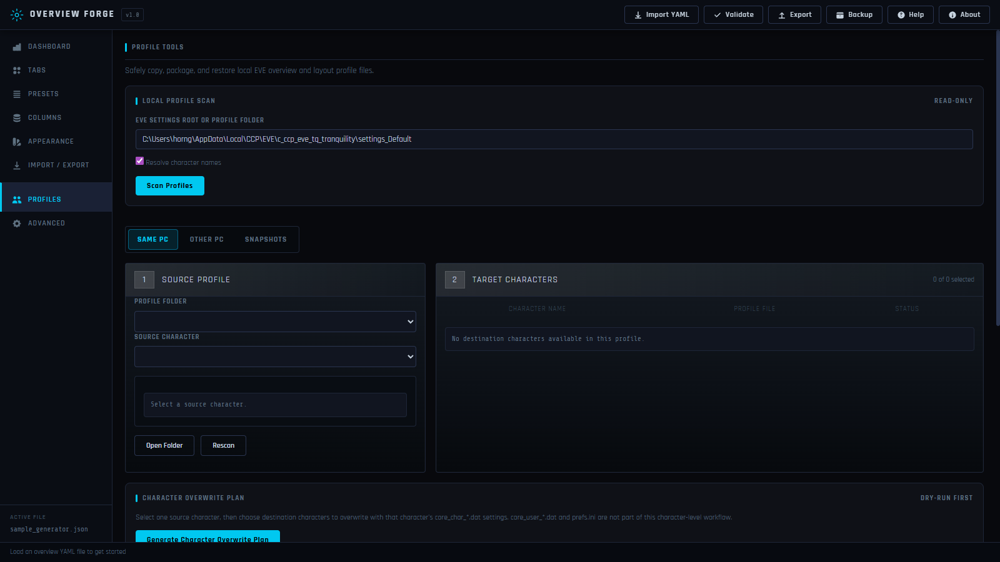
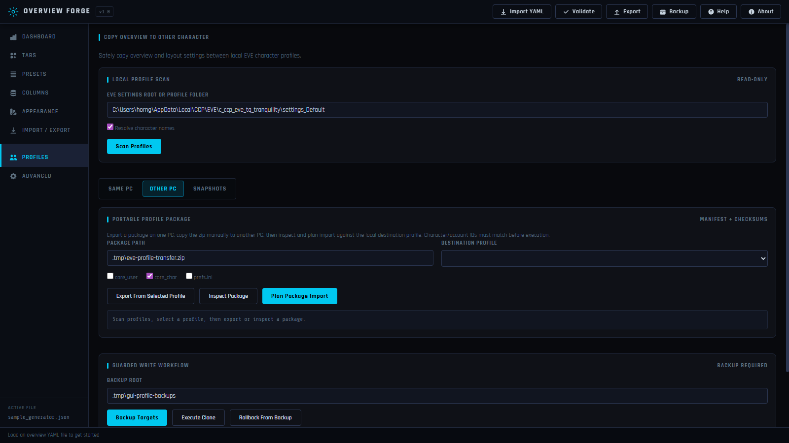
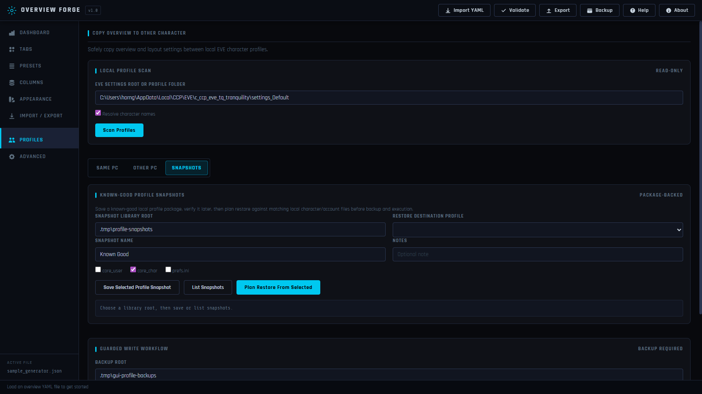

# Overview Forge

Local, offline-first EVE Online overview settings and profile helper.

The project has two separate workflows:

- Overview YAML editing, validation, import, export, and round-trip preservation.
- Local profile/layout backup and clone planning for opaque files such as `core_user_*.dat`, `core_char_*.dat`, and `prefs.ini`.



## Run The App GUI

For most users, use the portable release from the GitHub Releases page:

1. Download `overview-forge-portable.zip`.
2. Extract the zip to a normal folder.
3. Double-click `run-gui.bat`.
4. A browser window should open automatically at `http://localhost:7477`.

If the browser does not open, keep the command window running and manually open:

```text
http://localhost:7477
```

The first run creates a local `.venv` folder inside the extracted app folder and installs the required Python packages there. The app is local and runs in your browser; it is not an EVE client plugin.

## Custom Versions

If you want a customized version of this app, I can make the changes you want for a small ISK donation in game. Contact `Mizz Betty` in EVE Online.

## Safety Boundaries

This tool must remain a configuration generator, validator, backup tool, and local file manager.

It must not:

- Reverse engineer EVE client internals.
- Parse or edit `core_user_*.dat` or `core_char_*.dat` at field level.
- Packet sniff EVE traffic.
- Create or resolve in-game overview share links outside the EVE client.
- Modify the running EVE client.
- Automate in-game UI actions.
- Inject into the game process.
- Depend on ESI for core features.

Any future write operation that targets an EVE folder or profile folder must support dry-run mode, backup-before-write, preview, and rollback metadata.

## Completed Milestones

| # | Task | Status |
|---|------|--------|
| 1 | Project scaffold and docs | Done |
| 2 | YAML import/export/roundtrip foundation | Done |
| 3 | Real EVE YAML fixture support | Done |
| 5 | Canonical JSON import/export | Done |
| 6 | Structured validation engine | Done |
| 7 | Offline state dictionary and optional group validator | Done |
| 8 | Profile scanner | Done |
| 9 | Dry-run clone planner | Done |
| 10 | Backup manifests and verification | Done |
| 11 | Backup from clone plan | Done |
| 12 | Overview snapshots | Done |
| 13 | Snapshot list/restore-to-file | Done |
| 14 | Structured CLI errors for common expected failures | Done |
| 15 | Cleaner error coverage for every CLI command | Done |
| 16 | SDE file ingestion for real group ID validation | Done |
| 17 | Clone executor, gated by reviewed plan and verified backup | Done |
| 18 | Snapshot restore to YAML convenience command | Done |
| 19 | Project/workspace file format for future GUI | Done |
| 20 | Clone execution audit manifests | Done |
| 21 | GUI — Phase A: FastAPI server skeleton + dashboard screen | Done |
| 21b | GUI — Phase B: Tabs screen + live preview wired to real doc data | Done |
| 21c | GUI — Phase C: Presets screen + Types & States screen (with preset usage counts) | Done |
| 21d | GUI - Phase D: Appearance + Columns + Brackets screens | Done |
| 21e | GUI - Phase E: Profiles screen foundation and API routes | Done |
| 21e-2 | GUI - Profiles guarded backup/execute/rollback UI | Done |
| 21f | GUI - Phase F: Import/Export screen foundation | Done |
| 21f-2 | GUI - Full validation panel | Pending |
| 21g | GUI — Phase G: Polish, end-to-end smoke test | Pending |
| 21h | GUI - Backend live preview engine foundation | Done |
| 21i | GUI - Overview vs Brackets preview mode toggle | Done |
| 21j | GUI - Local preview group names for sample rows | Done |
| 21k | GUI - Preview appearance metadata and blink markers | Done |
| 21l | SDE group-name index builder for future preview metadata | Done |
| 21m | GUI - `group_names.json` preference wired into live preview | Done |
| 21n | GUI - Grouped Import / Export validation panel | Done |
| 21o | GUI - Export review and confirmation flow | Done |
| 21p | GUI - Manual snapshot creation and snapshot list | Done |
| 21q | GUI editor correctness fixes for presets, appearance, and columns | Done |
| 21r | GUI - Character-centric profile overwrite planning | Done |
| 21s | GUI stabilization: preview refresh, preset group visibility, tab cap, bracket toggle removal | Done |
| 21u | GUI - Appearance state labels, in-game palette, default tag colors, split blink rendering | Done |
| 22 | Optional modular overview generator foundation | Done |
| 23 | Legacy XML import path | Closed / deferred |
| 24 | GUI import/export preference helpers, unique filename helper, and API routes | Done |
| 26 | GUI workflow IA: Tabs hub and Advanced tools | Done |
| 27 | Profile package export, inspect, and import dry-run planning | Done |

## Progress Snapshot

Core foundation is largely complete. The remaining major work is GUI-facing:

- Continue GUI correctness work with the automated browser QA script and targeted manual checks.
- Add richer browser QA and visual polish for the Profiles and Import / Export screens.
- Extend the Import / Export screen with snapshots, deploy confirmation, and richer validation.
- Wire a full validation panel and bottom status bar to real validation/backup state.
- Polish existing GUI screens against the bundled screenshots and current app behavior.
- Run browser smoke tests once the GUI workflows are connected.

## Phase 1 Scope

Phase 1 establishes a testable core library and CLI scaffold:

- Canonical overview models.
- YAML import/export foundation designed for round-trip preservation.
- Structured validation result types and initial validation rules.
- Local profile scanner for direct profile paths and EVE roots containing `settings_*` folders.
- Backup/checksum service foundation.
- Opaque clone planning foundation.
- Guarded clone executor (blocked plan rejection, backup verification, dry-run gate).
- Clone execution audit manifests with before/after checksums per action.
- Minimal generator spec import for producing canonical JSON or YAML.
- CLI command shape for smoke testing.
- Unit tests for YAML, validation, profile scanning, backup, clone planning, and execution.

The GUI exists as a local FastAPI/plain HTML app, with several editor screens already implemented. ESI is not a core dependency; public character-name lookup is optional and cached. Legacy XML import is intentionally deferred because YAML is the supported EVE overview format for this tool.

## Current Behavior

- Current overview compatibility mode defaults to a 20-tab cap. Legacy mode keeps a 5-tab cap for older generators.
- Built-in EVE references such as `_BracketFilterShowAll` and `DefaultPreset_<digits>` are allowed during preset-reference validation.
- `Examples/standard_complete_overview.yaml` is a bundled broad starter/template overview built from the reviewed community packs, local preview catalog, and an in-game corrected export. It includes practical tabs, overview presets, bracket preset references, state filters, columns, labels, quieter appearance colors, ships, drones, NPCs, structures, deployables, PvP warp-to objects, and loot/salvage groups.
- The GUI Dashboard exposes that standard overview as the `Standard` new-overview template, so users can start from the maintained tab/preset set without importing the example file manually.
- YAML roundtrip is semantic rather than byte-for-byte. It preserves recognized content counts, unknown top-level keys, source top-level key order, and modeled pair-list order for `tabSetup`, `presets`, `shipLabels`, `userSettings`, `stateBlinks`, and `stateColorsNameList`.
- Validation warns on unknown overview column names and malformed `stateBlinks` keys.
- Validation includes an offline known-state dictionary and a pluggable group validator interface for future SDE-backed checks. Without local group data, group validation defaults to no-op.
- `--group-ids` can opt into offline group ID validation from a local JSON, JSON Lines, or text file.
- YAML import is tolerant and records structured `importWarnings` for malformed or unsupported shapes instead of silently dropping them.
- Profile scans include `settings_*` directories and ignore `settings_*.bak_*` folders during root scans.
- `.dat.bak` files are ignored. `core_user_*.dat`, `core_char_*.dat`, and `prefs.ini` are treated as opaque files.
- Profile scans expose `characterFiles` metadata. Numeric `core_char_<id>.dat` files are reported with character IDs, and `scan-profiles --resolve-names` can resolve those IDs through public ESI on demand. Resolved names are cached locally and `--name-cache` can override the cache file path.
- `profile-report` is read-only and summarizes one profile folder with file counts, sizes, timestamps, optional checksums, backup readiness, and optional character names.
- The Profiles GUI auto-fills the Local Profile Scan path from the normal Windows EVE settings location when it can detect one, while still allowing manual path entry.
- GUI preference helpers default import/export to `Documents\EVE\Overview`, remember folder changes, and generate unique output filenames instead of overwriting.
- GUI live preview is generated by the Python backend through `/api/preview`. It separates tab selection, overview preset filtering, state visibility rules, appearance class selection, and column rendering.
- GUI live preview supports Overview and Brackets modes. Overview mode uses a tab's `overviewPresetRef`; Brackets mode uses `bracketPresetRef`.
- Preview sample rows include local group-name metadata as a bridge toward full SDE-backed type/group display.
- `build-group-name-index` can create a local `group_names.json` from a CCP SDE archive. Preview code can consume a group-name map while falling back to bundled sample names.
- The Import / Export screen can remember or clear a `group_names.json` path. The live preview uses that file when available.
- The Import / Export screen includes a grouped validation panel with result details, paths, and suggested fixes.
- Export buttons now review validation status and the exact unique output path before writing YAML or JSON.
- The Import / Export screen can create manual overview snapshots and list recent snapshots from a chosen local snapshot root.
- Preset group checkboxes now map to numeric EVE group IDs, preset/state edits update the live preview, appearance reads/writes EVE-style state keys, and column edits drive the preview column layout.
- Profiles now support the intended character workflow: scan a profile folder, choose one source character from the left source card, choose destination characters from the right target table, generate a dry-run overwrite plan, then use the existing backup/execute safety workflow.
- Known-good profile snapshots use the profile-package workflow: save a named local snapshot of a trusted character/profile state, verify checksums when restoring, compare character/account IDs against the current local profile, dry-run restore, back up current files, then execute.
- Cross-PC profile transfer uses the same guarded package workflow: export a portable package on the source PC, copy it manually to the destination PC, scan the destination profile folder, verify matching character/account IDs, then dry-run, backup, and execute the import. The app must not blindly apply one PC's opaque profile files to another PC without this preflight comparison.
- Profile package export/inspect/import planning and guarded execution are available in the CLI and Profiles GUI. Package execution requires a reviewed dry-run plan and a verified backup manifest that covers every planned target file.
- The Profiles GUI Snapshots mode can save named known-good profile packages, list a local snapshot library, verify package checksums, and plan restore through the same backup/execute workflow.
- Package and snapshot restore preflight plans include package source names/IDs beside destination names/IDs where character metadata is available.
- Live preview refresh now runs after tab edits, slot `0` tabs are handled correctly, Presets displays raw selected numeric group IDs, current-mode tab creation uses the document tab cap, and the confusing bracket-mode toggle has been removed from the main preview until bracket behavior is represented more accurately.
- The GUI primary nav now follows the EVE workflow: Tabs is the main hub, Presets edits bound visibility rules, Columns/Appearance tune global presentation, Import / Export handles file boundary work, Profiles remains separate, and Types & States / Brackets live under Advanced.
- The Profiles screen uses a full-width copy workbench instead of the overview live preview, because profile cloning copies opaque local files and is not related to YAML preview filtering.
- Planned Presets correction: because presets are assigned to tabs but edited independently, the Presets screen preview should be driven by the selected preset without showing tab controls. The preview sample catalog must include rows for every visible state filter so state changes can be verified.
- Presets now has selected-preset preview plumbing and tab usage context; remaining preset work is to make every imported selected group ID editable even when it is outside the known checkbox catalog.
- Preview now generates clearly labeled rows for selected imported groups that are not in the static catalog, and includes state sample rows for every visible Presets state filter.
- Presets usage matching now recognizes tab refs by preset ID or name, and stale preview responses are ignored so selected-preset previews are not overwritten by older tab-preview requests.
- Presets no longer shows the selected-group summary box; imported groups outside the known catalog are preserved silently during checkbox edits, and direct preset preview gets state samples without adding those rows to normal tab preview.
- Preview debugging is available through `/api/preview?debug=true` and `/api/preview/self-test`. The browser can also log preview requests/responses when `localStorage.overviewForgePreviewDebug` is set to `1`. Preview rows fall back to `Group <id>` when no SDE group-name map is configured, so imported group IDs remain identifiable.
- Normal live preview is curated by default. Use `/api/preview?coverage=true` or set `localStorage.overviewForgePreviewCoverage` to `1` to show exhaustive generated rows for every selected imported group.
- Preview sample rows now avoid misleading non-entity state combinations such as `Sun with Fleet Member`; direct preset state samples choose a ship/NPC-like selected group when one exists.
- Preview sample coverage includes state variety for ships, drones, and structures/stations so friendly, hostile, neutral, suspect, and corporation/fleet filters can be checked across different entity types.
- Preview catalog includes Sun, Planet, Moon, Asteroid Belt, Encounter Surveillance System, and Abyssal Filament rows.
- The Presets group checkbox catalog includes a `Drones & Fighters` category for common drone and fighter groups.
- Presets now loads a source-controlled standard group catalog from `static/data/group_catalog.json`. The catalog includes common SDE groups and is searchable in the GUI.
- Columns now autosave checkbox and ordering changes; rows also have up/down controls in addition to drag-and-drop, and preview columns refresh from the backend after each change.
- Appearance supports per-state color tag and background colors, autosaves changes, and preview blink flashes enabled styling on/off roughly twice per second.
- Appearance color selectors are limited to the 12-color in-game palette: dark turquoise, purple, dark blue, turquoise, yellow, blue, violet, green, orange, black, white, and red.
- Default state tag colors match the in-game color tag defaults shown in the Appearance settings list.
- Common state labels used by the Presets, Appearance, and preview sample rows now match the in-game Appearance state label text shown by EVE. Numeric IDs remain preserved from the YAML.
- Preview blink rendering now separates foreground/color-tag blink from background blink so color-tag-only blink does not make every row pulse.
- Public/release packaging intentionally excludes downloaded third-party/community overview packs.
- Preview rows include resolved appearance metadata for flag state, background state, mapped colors, and blink flags.
- The preview is an editing aid built from local sample entities. It is not a live EVE client simulator and does not read or modify profile files.
- Clone planning is dry-run only. By default it maps matching `core_user`/`core_char` identifiers one-to-one. Use `--copy-first-to-all` only when deliberately cloning one source file to every target file of the same type.
- Non-numeric or empty core file identifiers are preserved but reported as warnings in clone plans.
- Clone plan JSON includes a `summary` with source/target file counts, action count, missing source/target IDs, `requiresBackup`, and `dryRun`.
- Clone actions include `sourceId`, `targetId`, `risk`, and `wouldOverwrite` so future execution can require an explicit reviewed plan.
- `execute-clone` writes an `execution_manifest.json` beside the backup manifest after a successful clone. The manifest records the operation ID, UTC timestamp, plan path, backup manifest path, app version, and per-action source/before/after SHA-256 checksums plus bytes copied.
- `rollback-backup` verifies a backup manifest, restores each backed-up file to its original path, and writes `rollback_manifest.json` beside the backup manifest.

## Development

Create a virtual environment and install the project:

```powershell
python -m venv .venv
.\.venv\Scripts\Activate.ps1
python -m pip install -e .[dev]
```

Run checks:

```powershell
python -m compileall src
python -m pytest
python scripts\gui_smoke_qa.py --port 7478
```

The GUI QA script uses Playwright. If Chromium is not installed yet, run:

```powershell
python -m playwright install chromium
```

## Portable Folder Build

The app does not need to be installed globally. To create a folder-run release:

```powershell
python scripts\build_portable.py
```

This writes `dist\overview-forge-portable.zip`. Users can extract it and run `run-gui.bat`. The first run creates a local `.venv` inside that folder and installs dependencies there only.

Portable builds intentionally include only `Examples\standard_complete_overview.yaml`. Third-party/community overview samples are not included.

## GitHub Publishing

Repository publishing notes are in `PUBLISHING.md`.

Before pushing public:

- Do not stage `.tmp/`, `.playwright-mcp/`, `.pytest_cache/`, `*.egg-info/`, or local EVE profile files.
- Do not stage `core_user_*.dat`, `core_char_*.dat`, `prefs.ini`, local backups, or snapshots.
- Do not stage downloaded/community overview packs. Public/release packaging should include only `Examples/standard_complete_overview.yaml`.

## Screenshots




CLI entrypoint:

```powershell
eve-overview --help
eve-overview validate-yaml Examples/standard_complete_overview.yaml --format json
eve-overview validate-yaml Examples/standard_complete_overview.yaml --group-ids .tmp\group_ids.json --format json
eve-overview download-sde .tmp\sde-jsonl.zip --format-kind jsonl --format json
eve-overview build-group-index .tmp\sde-jsonl.zip .tmp\group_ids.json --format json
eve-overview build-group-name-index .tmp\sde-jsonl.zip .tmp\group_names.json --format json
eve-overview roundtrip-yaml Examples/standard_complete_overview.yaml .tmp\roundtrip.yaml --format json
eve-overview export-json Examples/standard_complete_overview.yaml .tmp\standard.json --format json
eve-overview validate-json .tmp\standard.json --format json
eve-overview export-yaml-from-json .tmp\standard.json .tmp\standard.yaml --format json
eve-overview create-project .tmp\workspace.eveoverview.json --name "My Overview" --overview-json .tmp\standard.json --snapshot-root .tmp\snapshots --sde-archive .tmp\sde-jsonl.zip --group-index .tmp\group_ids.json --format json
eve-overview validate-project .tmp\workspace.eveoverview.json --format json
eve-overview snapshot-yaml Examples/standard_complete_overview.yaml --snapshot-root .tmp\snapshots --operation-type import-yaml --format json
eve-overview list-snapshots --snapshot-root .tmp\snapshots --format json
eve-overview restore-snapshot .tmp\snapshots\<snapshot>\snapshot_manifest.json .tmp\restored.json --format json
eve-overview restore-snapshot-yaml .tmp\snapshots\<snapshot>\snapshot_manifest.json .tmp\restored.yaml --format json
eve-overview scan-profiles %LOCALAPPDATA%\CCP\EVE\c_ccp_eve_tq_tranquility --format json
eve-overview plan-clone --source C:\Path\To\source_settings --target C:\Path\To\target_settings --core-user --format json
eve-overview plan-clone --source C:\Path\To\source_settings --target C:\Path\To\target_settings --core-char --copy-first-to-all --format json
eve-overview backup-profile C:\Path\To\settings_Default --backup-root .tmp\backups --format json
eve-overview backup-plan .tmp\clone-plan.json --backup-root .tmp\backups --format json
eve-overview execute-clone .tmp\clone-plan.json --backup-manifest .tmp\backups\<timestamp>\backup_manifest.json --format json
eve-overview rollback-backup .tmp\backups\<timestamp>\backup_manifest.json --format json
eve-overview export-profile-package %LOCALAPPDATA%\CCP\EVE\c_ccp_eve_tq_tranquility\settings_Default .tmp\known-good-profile.zip --snapshot-name "Known Good" --format json
eve-overview inspect-profile-package .tmp\known-good-profile.zip --format json
eve-overview plan-profile-package-import .tmp\known-good-profile.zip %LOCALAPPDATA%\CCP\EVE\c_ccp_eve_tq_tranquility\settings_Default --format json
eve-overview execute-profile-package-import .tmp\package-import-plan.json --backup-manifest .tmp\backups\<timestamp>\backup_manifest.json --format json
eve-overview scan-profiles %LOCALAPPDATA%\CCP\EVE\c_ccp_eve_tq_tranquility\settings_Default --resolve-names --format json
eve-overview profile-report %LOCALAPPDATA%\CCP\EVE\c_ccp_eve_tq_tranquility\settings_Default --resolve-names --format json
eve-overview profile-report %LOCALAPPDATA%\CCP\EVE\c_ccp_eve_tq_tranquility\settings_Default --resolve-names --name-cache .tmp\character_names.json --format json
```

`validate-yaml` returns JSON with `importWarnings`, `validationResults`, and a combined `results` list for compatibility with early smoke tests.
Expected CLI failures return structured JSON errors with an `error.code`, `error.message`, and optional `error.details`. Argument misuse exits with code `2`; user-facing operation failures exit with code `1`.

Official CCP SDE downloads use the latest JSONL/YAML archive URLs documented at `developers.eveonline.com/static-data/`. `build-group-index` converts a downloaded SDE archive or extracted group file into the local `group_ids.json` format used by `--group-ids`. `build-group-name-index` writes a separate `group_names.json` map for UI/preview metadata.

YAML is the official EVE import/export format. Canonical JSON is the app-native format intended for future GUI editing, diffing, and project persistence.
Workspace project JSON references the canonical overview document, snapshot root, optional SDE archive/group index, and optional profile roots without embedding or modifying EVE profile files.
The generator spec is intentionally small in this phase: tabs, presets, columns, labels, appearance, misc settings, and unknown passthrough fields. It is a foundation for later modular source layouts, not a complete rules engine.

Overview snapshots store immutable canonical JSON plus a checksum manifest for local rollback/version history.
Snapshot restore verifies the checksum first and writes to a user-chosen JSON or YAML output path. It does not overwrite existing files unless `--overwrite` is provided.

### SDE Group Validation Workflow

Group validation is optional and offline. The app does not contact ESI and normal validation works without SDE data.

Download the current CCP static data export:

```powershell
eve-overview download-sde .tmp\sde-jsonl.zip --format-kind jsonl --format json
```

Build a local group ID index from the downloaded archive:

```powershell
eve-overview build-group-index .tmp\sde-jsonl.zip .tmp\group_ids.json --format json
eve-overview build-group-name-index .tmp\sde-jsonl.zip .tmp\group_names.json --format json
```

Validate overview YAML or canonical JSON against that local group index:

```powershell
eve-overview validate-yaml Examples\standard_complete_overview.yaml --group-ids .tmp\group_ids.json --format json
eve-overview validate-json .tmp\standard.json --group-ids .tmp\group_ids.json --format json
```

For project files, store the SDE archive and group index paths as references:

```powershell
eve-overview create-project .tmp\workspace.eveoverview.json --name "My Overview" --overview-json .tmp\real.json --sde-archive .tmp\sde-jsonl.zip --group-index .tmp\group_ids.json --format json
eve-overview validate-project .tmp\workspace.eveoverview.json --format json
```

The downloaded SDE and generated `group_ids.json` / `group_names.json` files are local files. Delete or replace them whenever you want to refresh validation and metadata against a newer CCP export.

Recommended safe clone workflow:

1. Run `scan-profiles` to identify source and target profile folders.
2. Run `plan-clone` and review the JSON actions, warnings, and summary.
3. Save the reviewed plan JSON.
4. Run `backup-plan` to back up only the target files listed in the plan.
5. Run `execute-clone` only after reviewing the plan JSON and verifying that `backup-plan` completed successfully.
6. Use `rollback-backup` with that backup manifest if the clone must be reverted.

Safe cross-PC transfer workflow:

1. On the source PC, scan the profile folder and export a portable profile package with a manifest and SHA-256 checksums using `export-profile-package`.
2. Copy that package manually to the destination PC.
3. On the destination PC, scan the local EVE profile folder before importing.
4. Inspect the package with `inspect-profile-package` and compare character IDs/names and any included account/profile IDs against the destination files.
5. Generate a dry-run import plan with `plan-profile-package-import`. Block import when required characters/accounts are missing or mismatched unless an explicit future advanced override exists.
6. Back up all target files from the import plan.
7. Execute with `execute-profile-package-import` only after backup verification, then write an import audit manifest.

Planned known-good profile snapshot workflow:

1. Scan the local profile folder and choose the trusted character/profile scope.
2. Create a named profile snapshot package with a manifest, user note, timestamps, file list, character/account IDs, and SHA-256 checksums.
3. Store the package in a local snapshot library folder chosen by the user.
4. When restoring, inspect the snapshot and verify its checksums first.
5. Scan the current local destination profile folder and compare IDs before planning restore.
6. Generate a dry-run restore plan. Block restore if required character/account IDs are missing or mismatched.
7. Back up current target files, execute restore, and write a restore audit manifest.

### Real Profile Safety Walkthrough

Your current Tranquility profile root is:

```powershell
%LOCALAPPDATA%\CCP\EVE\c_ccp_eve_tq_tranquility\settings_Default
```

Start with read-only discovery:

```powershell
eve-overview scan-profiles %LOCALAPPDATA%\CCP\EVE\c_ccp_eve_tq_tranquility --format json
eve-overview scan-profiles %LOCALAPPDATA%\CCP\EVE\c_ccp_eve_tq_tranquility\settings_Default --format json
eve-overview scan-profiles %LOCALAPPDATA%\CCP\EVE\c_ccp_eve_tq_tranquility\settings_Default --resolve-names --format json
eve-overview profile-report %LOCALAPPDATA%\CCP\EVE\c_ccp_eve_tq_tranquility\settings_Default --resolve-names --format json
```

Create a full profile backup before experimenting:

```powershell
eve-overview backup-profile %LOCALAPPDATA%\CCP\EVE\c_ccp_eve_tq_tranquility\settings_Default --backup-root .tmp\real-profile-backups --format json
```

For a clone operation, first produce and save a dry-run plan. Replace `<source_settings>` and `<target_settings>` with explicit profile folders from the scan output:

```powershell
eve-overview plan-clone --source <source_settings> --target <target_settings> --core-user --core-char --prefs --format json > .tmp\real-clone-plan.json
eve-overview backup-plan .tmp\real-clone-plan.json --backup-root .tmp\real-clone-backups --format json
eve-overview execute-clone .tmp\real-clone-plan.json --backup-manifest .tmp\real-clone-backups\<timestamp>\backup_manifest.json --format json
```

If the clone result needs to be reverted, use the exact backup manifest from the `backup-plan` step:

```powershell
eve-overview rollback-backup .tmp\real-clone-backups\<timestamp>\backup_manifest.json --format json
```

Close the EVE client before running `execute-clone` or `rollback-backup` so the client does not rewrite the same files while the tool is copying them.

## GUI

Start the GUI with:

```powershell
eve-overview gui
eve-overview gui --port 7477 --no-browser
```

The browser opens automatically at `http://localhost:7477`. The GUI is a local FastAPI + plain HTML/JS/CSS app — no npm, no Electron.

### Screens implemented

| Screen | Status | Notes |
|--------|--------|-------|
| Dashboard | Done | Overview summary stats, validation status, recent files, Standard/Blank/PVP/Mining template shortcuts |
| Tabs | Done | Colored pill list, drag reorder, color picker, preset bindings |
| Presets | Done | Card list, group checkboxes, per-state Always Show / Filtered / Default radio table |
| Types & States | Done | Reference panel — entity groups (collapsible) + states with preset usage counts and tooltips |
| Appearance | Done | In-game state labels, 12-color palette, default tag colors, backgrounds, split foreground/background blink controls |
| Columns | Done | Column order and enabled-column controls |
| Brackets | Done | Ship label/bracket label controls |
| Profiles | Done | Same PC / Other PC / Snapshots modes, character-copy workbench, scan, report, character names, dry-run clone plan, profile packages, snapshot library, guarded backup/execute/rollback |
| Import / Export | Done | Browse import, remembered folder, unique filenames, YAML/JSON export, generator spec flow |
| Full validation panel | Pending | Phase F/G - grouped results and status strip integration |

### Live preview

The right panel shows a live overview preview at all times. The tab strip reflects real tab names and colors from the loaded document and updates instantly as you edit.
Preview rows are synthetic but include common real overview entities from the provided screenshot references, including structures, stargates, planets, beacons, sovereignty hubs, jump bridges, drones, moons, and ships. The preview filters those rows using the active tab's bound preset groups and state rules, so hiding types/states changes what is shown.

Preview self-test endpoints are available while the GUI is running:

- `/api/preview?debug=true` returns the normal preview plus diagnostics for the current request, active tab/preset, row count, columns, groups, states, first rows, and a stable fingerprint.
- `/api/preview/self-test` builds tab-driven and preset-driven coverage previews for the loaded document and reports row counts/fingerprints so preset changes can be compared without relying on visual inspection alone.
- To log frontend preview requests and responses in the browser console, run `localStorage.setItem('overviewForgePreviewDebug', '1')` and reload. Disable it with `localStorage.removeItem('overviewForgePreviewDebug')`.
- To make the browser live preview exhaustive for testing, run `localStorage.setItem('overviewForgePreviewCoverage', '1')` and reload. Disable it with `localStorage.removeItem('overviewForgePreviewCoverage')`.

## Project Layout

```text
src/eve_overview_manager/
  cli.py
  models/
  yaml_io/
  validation/
  profiles/
  services/
  gui/
    server.py         # FastAPI app builder + uvicorn launcher
    state.py          # In-memory document store
    routes/           # API route modules (document, tabs, presets, appearance, columns, brackets, validate, recent)
    static/
      index.html
      app.css
      app.js
      screens/        # Per-screen JS (dashboard, tabs, presets, types, appearance, columns, brackets)
Examples/
  standard_complete_overview.yaml
scripts/
tests/
```

